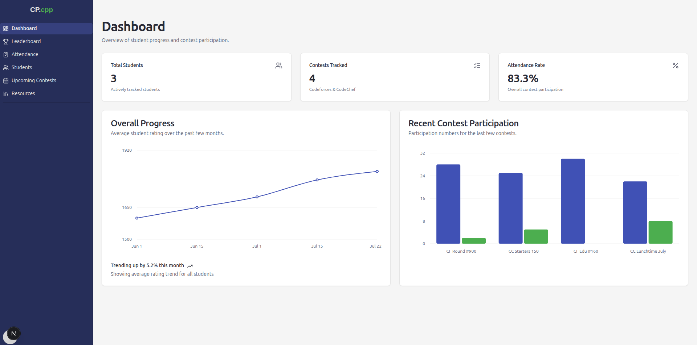
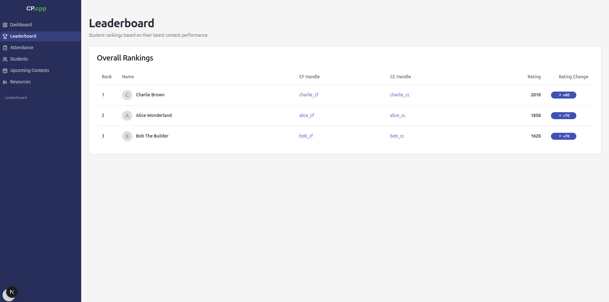
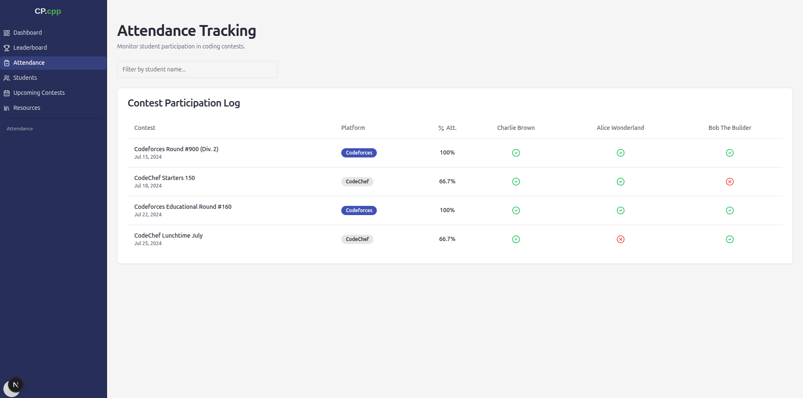
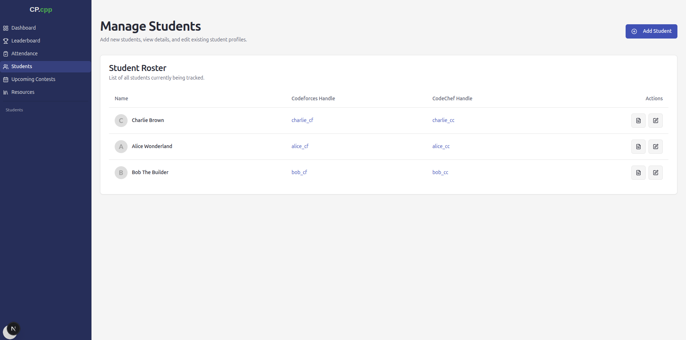

# 🚀 CP Club Manager

CP Club Manager is a comprehensive web application built with **Next.js** to streamline the management of a student competitive coding club.  
It provides a centralized dashboard for tracking student progress, managing resources, organizing events, and fostering competitive programming culture.

---

## 📸 Screenshots







---

## ✨ Features

- **Dashboard**
  - Overview of club statistics
  - Participation rates
  - Upcoming events and contests

- **Student Management**
  - Add, edit, and view student details
  - Import student lists in bulk

- **Attendance Tracking**
  - Monitor attendance for meetings and events
  - Maintain historical attendance records

- **Leaderboard**
  - Dynamic leaderboard for contests and activities
  - Rank students based on performance

- **Resource Hub**
  - Centralized learning materials
  - Categorized into:
    - Theory
    - Practice
    - Think

- **Upcoming Contests**
  - Keep members informed about upcoming coding competitions

---

## 🛠️ Tech Stack

- **Framework:** [Next.js](https://nextjs.org/)
- **Language:** [TypeScript](https://www.typescriptlang.org/)
- **Styling:** [Tailwind CSS](https://tailwindcss.com/)
- **UI Components:** [shadcn/ui](https://ui.shadcn.com/)
- **Linting:** [ESLint](https://eslint.org/)

---

## ⚙️ Getting Started

Follow these instructions to get the project running locally.

---

### 📌 Prerequisites

Make sure you have the following installed:

- **Node.js** (v18.x or later)  
  👉 https://nodejs.org/en/
- **npm** or **yarn**

---

### 📥 Installation & Setup

1. **Clone the repository**
   ```bash
   git clone <your-repository-url>
   cd <repository-folder>
2. **Install dependencies**
   ```bash
   npm install
3. **Run the development server**
   ```bash
   npm run dev
4. **Open in browser**
   ```bash
   http://localhost:3000
 
---

### 🗂️ Project Structure
 
``` 
.
├── public/                 # Static assets
│   └── screenshots/        # Project screenshots (used in README)
│
├── src/
│   ├── app/                # Application routes (Next.js App Router)
│   ├── components/         # Reusable UI components
│   ├── hooks/              # Custom React hooks
│   ├── lib/                # Utility functions and shared logic
│   └── types/              # TypeScript type definitions
│
├── package.json            # Project dependencies and scripts
└── tsconfig.json           # TypeScript configuration

```

---

If you want, next I can:
- ⭐ optimize this README for **resume/recruiter impact**
- ⭐ add **badges** (Next.js, TypeScript, Tailwind, Vercel)
- ⭐ make a **one-line powerful project description** for your resume

Just say 👍

